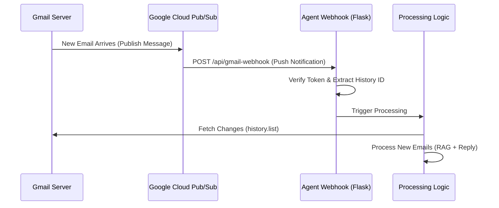

# Technical Design: Trigger-Based Email Processing (Gmail Push Notifications)

## 1. Overview
Currently, the system uses **Polling** (checking for new emails every 60 seconds). To make it **Trigger-based** (Real-time), we need to implement **Gmail Push Notifications** using Google Cloud Pub/Sub.

Instead of the agent asking *"Are there new emails?"*, Gmail will tell the agent *"There is a new email!"* immediately.

---

## 2. Architecture Diagram



---

## 3. Required Components

### 3.1 Google Cloud Platform (GCP) Setup
1.  **Pub/Sub Topic**: Create a topic (e.g., `projects/my-project/topics/gmail-notifications`).
2.  **Pub/Sub Subscription**: Create a subscription for the topic.
    *   **Type**: Push
    *   **Endpoint**: Your public webhook URL (e.g., `https://api.mydomain.com/gmail-webhook`).
3.  **Permissions**: Grant `gmail-api-push@system.gserviceaccount.com` permission to publish to the topic.

### 3.2 Public Webhook Endpoint
The local agent (running on `localhost`) cannot receive push notifications directly from Google. You need a public URL.
*   **Development**: Use a tunneling service like **ngrok** (`ngrok http 5000`) to expose your local Flask app.
*   **Production**: Deploy the Flask app to a cloud server (AWS, Heroku, GCP) with a static IP/Domain.

### 3.3 Code Changes

#### A. `GmailService` Updates
*   **`watch()` method**: Call `users.watch()` API on startup. This tells Gmail: *"Start sending notifications to this Pub/Sub topic."*
*   **`stop()` method**: Call `users.stop()` on shutdown.
*   **`fetch_changes(history_id)`**: Instead of `list_messages(is:unread)`, use `history.list(startHistoryId=...)` to get *exactly* what changed since the last notification.

#### B. `Dashboard.py` (Flask App) Updates
*   **New Route**: `POST /api/gmail-webhook`
*   **Logic**:
    1.  Receive the JSON payload from Pub/Sub.
    2.  Decode the message data (Base64).
    3.  Extract the `historyId` and `emailAddress`.
    4.  Trigger `AgentService.process_updates(history_id)`.

---

## 4. Implementation Steps

### Step 1: Configure Google Cloud
1.  Go to [Google Cloud Console](https://console.cloud.google.com/).
2.  Enable **Cloud Pub/Sub API**.
3.  Create a Topic: `gmail-watch`.
4.  Add IAM Member: `gmail-api-push@system.gserviceaccount.com` -> Role: `Pub/Sub Publisher`.
5.  Create a Subscription: `gmail-watch-sub` -> Delivery Type: `Push` -> URL: `https://<your-ngrok-url>/api/gmail-webhook`.

### Step 2: Update `GmailService`
Add the `watch` command:
```python
def watch_inbox(self):
    request = {
        'labelIds': ['INBOX'],
        'topicName': 'projects/YOUR_PROJECT_ID/topics/gmail-watch'
    }
    self.service.users().watch(userId='me', body=request).execute()
```

### Step 3: Create Webhook in Flask
```python
@app.route('/api/gmail-webhook', methods=['POST'])
def gmail_webhook():
    envelope = request.get_json()
    if not envelope:
        return 'Bad Request', 400

    # Decode Pub/Sub message
    pubsub_message = envelope['message']
    data = base64.b64decode(pubsub_message['data']).decode('utf-8')
    json_data = json.loads(data)
    
    history_id = json_data.get('historyId')
    
    # Trigger processing (Async recommended)
    agent_service.process_changes(history_id)
    
    return 'OK', 200
```

### Step 4: Switch from Polling to Event-Driven
*   Remove the `while True: sleep(60)` loop in `run.py`.
*   Instead, just run the Flask app (`app.run()`). The app waits for the webhook hit.
*   On startup, call `gmail_service.watch_inbox()`.
*   **Note**: The `watch` expires every 7 days, so you need a cron job or scheduler to re-call it periodically.

---

## 5. Pros & Cons

| Feature | Polling (Current) | Trigger-Based (Proposed) |
| :--- | :--- | :--- |
| **Latency** | High (up to 60s delay) | Low (Near Real-time) |
| **Complexity** | Low (Local script) | High (Requires GCP + Public URL) |
| **Cost** | Free (API Quota) | Free (within limits), but infrastructure costs |
| **Setup** | Simple | Complex (Pub/Sub, Webhooks, ngrok) |

## 6. Recommendation
For a **local demo or MVP**, Polling is superior due to simplicity.
For a **production deployment**, Trigger-based is required for scale and responsiveness.
