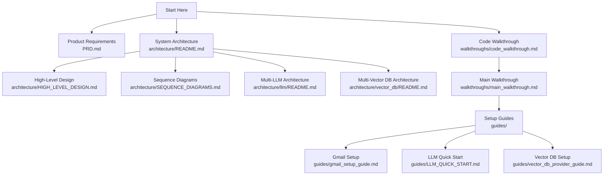

# Project Documentation

Welcome to the AI Customer Support Agent documentation. This directory contains comprehensive technical documentation for the entire system.

## 📐 Architecture

### Core Documentation
- **[System Architecture Overview](architecture/README.md)** - Complete system architecture, components, and data flows
- **[High-Level Design (HLD)](architecture/HIGH_LEVEL_DESIGN.md)** - Deployment architecture, component layers, scalability, and performance
- **[Sequence Diagrams](architecture/SEQUENCE_DIAGRAMS.md)** - Detailed interaction flows for all major workflows

### Specialized Architecture
- **[Multi-LLM Provider Architecture](architecture/llm/README.md)** - LLM provider system with automatic fallback (Gem ini, Claude)
- **[Multi-Vector DB Provider Architecture](architecture/vector_db/README.md)** - Vector database abstraction (Pinecone, future providers)

## 📚 Guides

Step-by-step setup and configuration guides:

- **[LLM Quick Start Guide](guides/LLM_QUICK_START.md)** - Set up LLM providers and configuration
- **[Gmail Setup Guide](guides/gmail_setup_guide.md)** - Configure Gmail API authentication
- **[Vector DB Provider Guide](guides/vector_db_provider_guide.md)** - Set up vector database providers

## 🚶 Walkthroughs

### For Developers
- **[Code Walkthrough](walkthroughs/code_walkthrough.md)** - Comprehensive code tour: project structure, services, design patterns, and flow examples

### For Users
- **[Main Walkthrough](walkthroughs/main_walkthrough.md)** - Installation, configuration, and usage guide
- **[Troubleshooting Guide](walkthroughs/troubleshooting.md)** - Common issues and solutions

## 💬 AI Prompts

System prompts and templates used by the AI agent:

- **[Prompts Directory](prompts/)** - All prompt templates
  - Agent system prompts
  - Email classification prompts
  - Response generation templates
  - Retriever tool descriptions

## 📄 Product Documentation

- **[Product Requirements Document (PRD)](PRD.md)** - Complete product specifications, user stories, and technical architecture

## 🗺️ Documentation Map

## 🎯 Quick Navigation

### I want to...

**Understand the system architecture**
→ Start with [Architecture Overview](architecture/README.md)  
→ Then read [High-Level Design](architecture/HIGH_LEVEL_DESIGN.md)

**Understand the code**
→ Read [Code Walkthrough](walkthroughs/code_walkthrough.md)

**Set up the system**
→ Follow [Main Walkthrough](walkthroughs/main_walkthrough.md)  
→ Reference specific [Guides](guides/) as needed

**Understand multi-LLM support**
→ Read [Multi-LLM Architecture](architecture/llm/README.md)  
→ Check [Sequence Diagrams - LLM Fallback](architecture/SEQUENCE_DIAGRAMS.md#3-llm-provider-fallback-flow)

**Understand multi-Vector DB support**
→ Read [Multi-Vector DB Architecture](architecture/vector_db/README.md)  
→ Check [Sequence Diagrams - Vector Search](architecture/SEQUENCE_DIAGRAMS.md#4-vector-db-search-flow)

**Add a new LLM provider**
→ Follow guide in [Multi-LLM Architecture - Adding a New Provider](architecture/llm/README.md#adding-a-new-provider)

**Add a new Vector DB provider**
→ Follow guide in [Multi-Vector DB Architecture - Adding a New Provider](architecture/vector_db/README.md#adding-a-new-provider)

**See how emails are processed**
→ Check [Sequence Diagrams - Email Processing](architecture/SEQUENCE_DIAGRAMS.md#1-email-processing-workflow-complete-flow)

**Debug an issue**
→ Check [Troubleshooting Guide](walkthroughs/troubleshooting.md)

## 📖 Documentation Standards

### Diagrams
All architecture diagrams use **Mermaid** syntax for:
- Component diagrams
- Sequence diagrams
- State diagrams
- Flow charts

### Code Examples
- Python code blocks use syntax highlighting
- Examples are complete and runnable
- Configuration snippets show actual `.env` format

### File References
- All file paths use absolute paths
- Code references link to actual files
- Line numbers included where relevant

## 🔄 Documentation Maintenance

This documentation was generated from the codebase on **2025-11-29** and should be updated when:

- New providers are added
- Architecture changes significantly
- New features are implemented
- Breaking changes occur

## 📊 Documentation Coverage

### Architecture ✅
- [x] System overview
- [x] High-level design  
- [x] Sequence diagrams (9 workflows)
- [x] Multi-LLM architecture
- [x] Multi-Vector DB architecture

### Code ✅
- [x] Complete code walkthrough
- [x] Design patterns explanation
- [x] Service layer documentation

### Guides ✅
- [x] Gmail setup
- [x] LLM configuration
- [x] Vector DB configuration
- [x] Main user walkthrough

### Product ✅
- [x] PRD (Product Requirements)
- [x] User stories
- [x] Technical specifications

---

**Last Updated**: November 29, 2025  
**Codebase Version**: Python 3.12+  
**Architecture Status**: Multi-LLM ✅ | Multi-Vector DB ✅ | Gmail Integration ✅