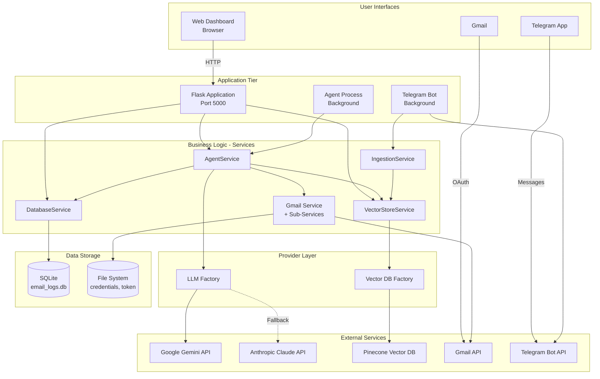
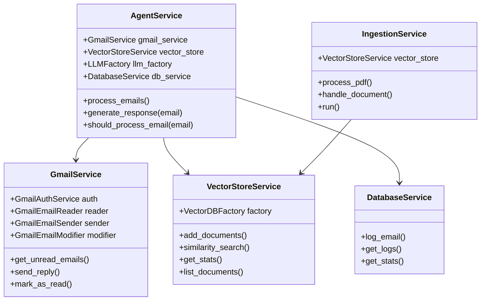
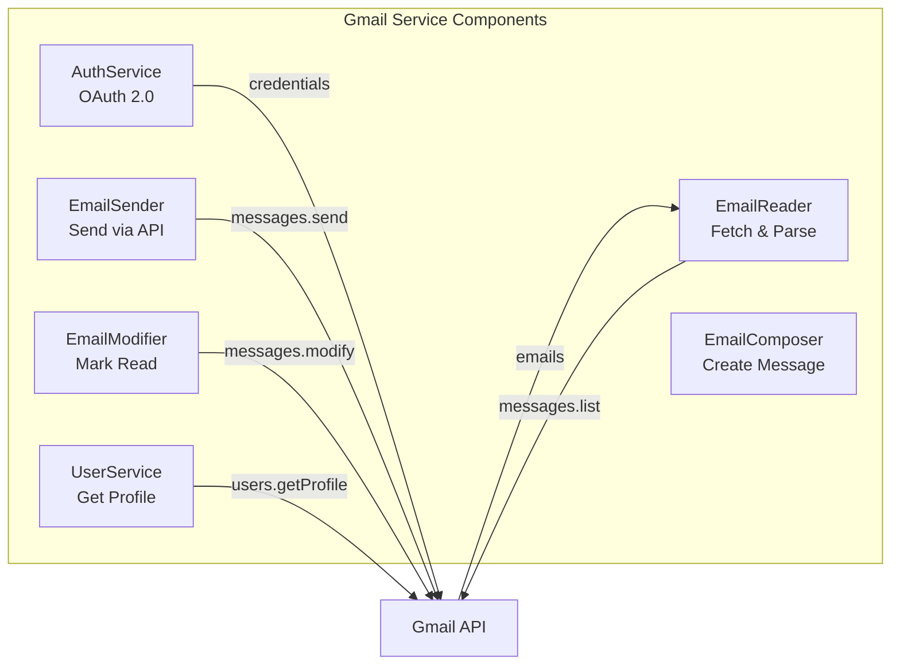
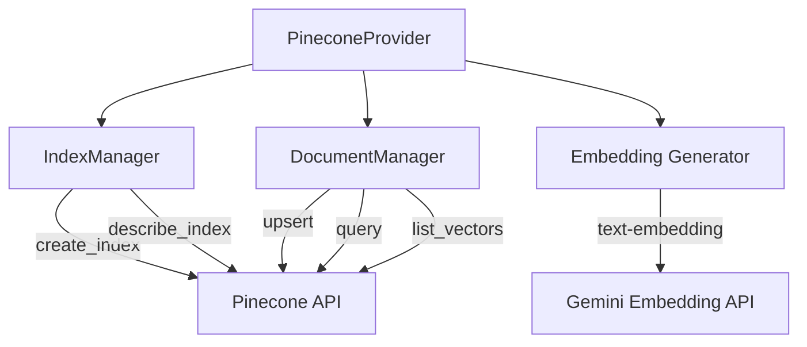
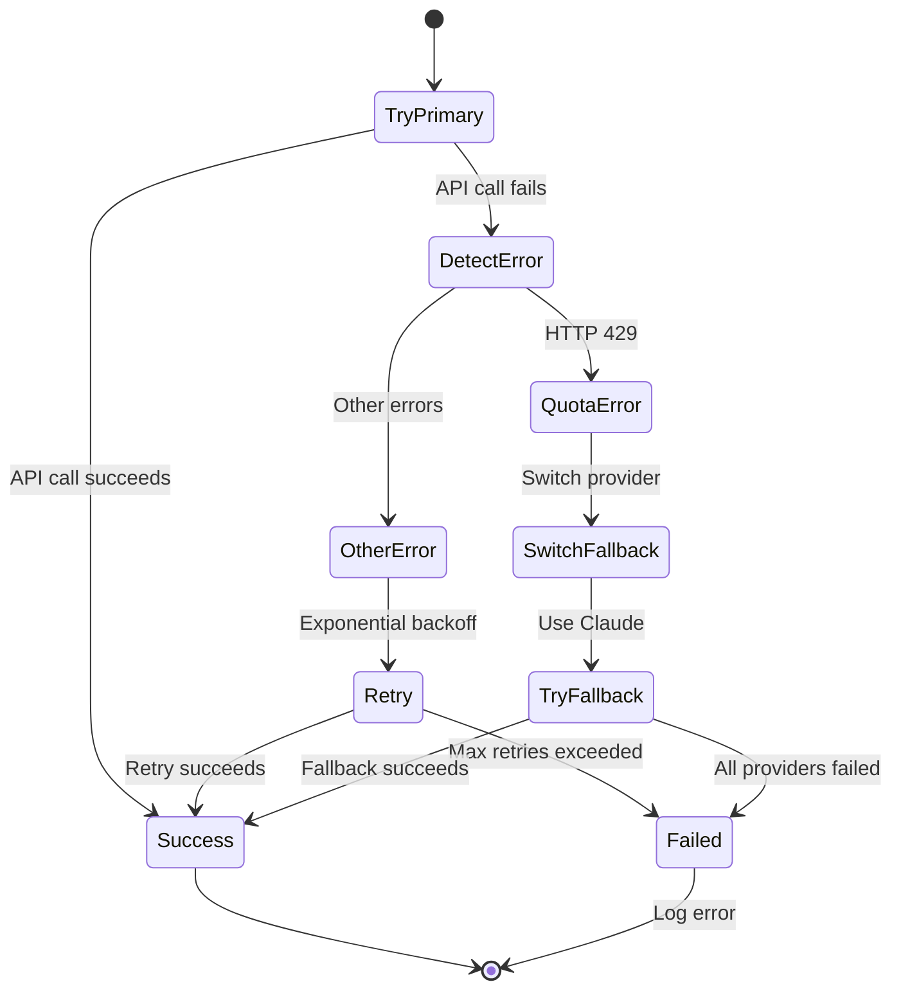

# High-Level Design (HLD)

## System Overview

The AI Customer Support Agent is a **microservices-style** system with clear separation between entry points, business logic, and external integrations. The architecture supports horizontal scaling and provider flexibility.

## Deployment Architecture



## Component Layers

### Layer 1: Entry Points

#### Flask Web Application
- **Purpose**: Serve dashboard and provide REST API
- **Components**:
  - **Web Blueprint** (`/`, `/knowledge-base`) - Renders HTML pages
  - **API Blueprint** (`/api/logs`, `/api/upload`, `/api/knowledge-base`) - JSON endpoints
- **Technology**: Flask, Flask-CORS, Jinja2
- **Port**: 5000 (default)

#### CLI Runner (run.py)
- **Purpose**: Command-line interface for agent and ingestion
- **Commands**:
  - `python run.py agent --poll-interval 60` - Start email agent
  - `python run.py ingest` - Start Telegram bot
- **Technology**: argparse, multiprocessing

### Layer 2: Service Layer (Business Logic)



#### Service Responsibilities

| Service | Responsibility | Dependencies |
|---------|---------------|--------------|
| **AgentService** | Email processing orchestration | Gmail, VectorStore, LLMFactory, Database |
| **GmailService** | Facade for Gmail operations | Gmail sub-services (Auth, Reader, Sender, etc.) |
| **VectorStoreService** | Vector DB operations | VectorDBFactory |
| **IngestionService** | PDF document ingestion | VectorStoreService, Telegram |
| **DatabaseService** | Activity logging | SQLite |

### Layer 3: Provider Factories

#### LLM Factory Architecture

```mermaid
graph TD
    subgraph "LLMFactory"
        Factory[LLM Factory]
        Registry[Provider Registry]
        Fallback[Fallback Manager]
    end
    
    subgraph "Provider Interface"
        Base[LLMProvider<br/>Abstract Base]
    end
    
    subgraph "Concrete Providers"
        Gemini[GeminiProvider]
        Claude[ClaudeProvider]
        Future[Future Providers...]
    end
    
    Factory --> Registry
    Factory --> Fallback
    Factory --> Base
    
    Base <|.. Gemini
    Base <|.. Claude
    Base <|.. Future
    
    Registry -.->|stores| Gemini
    Registry -.->|stores| Claude
    
    Factory -->|Primary| Gemini
    Factory -.->|Falls back to| Claude
```

**LLMProvider Interface**:
```python
class LLMProvider(ABC):
    @abstractmethod
    def generate_content(prompt, temperature, max_tokens) -> LLMResponse
    
    @abstractmethod
    def get_provider_name() -> str
    
    @abstractmethod
    def is_available() -> bool
```

**Fallback Logic**:
1. Try primary provider (Gemini)
2. If quota error (HTTP 429) or failure:
   - Detect error type
   - Switch to next fallback (Claude)
   - Retry request
3. Exponential backoff on retries
4. Return error if all providers fail

#### Vector DB Factory Architecture

```mermaid
graph TD
    subgraph "VectorDBFactory"
        VFactory[Vector DB Factory]
        VRegistry[Provider Registry]
    end
    
    subgraph "Provider Interface"
        VBase[VectorDBProvider<br/>Abstract Base]
    end
    
    subgraph "Pinecone Provider"
        PProvider[PineconeProvider]
        IndexMgr[IndexManager]
        DocMgr[DocumentManager]
    end
    
    subgraph "Future Providers"
        Weaviate[WeaviateProvider]
        Chroma[ChromaProvider]
    end
    
    VFactory --> VRegistry
    VFactory --> VBase
    
    VBase <|.. PProvider
    VBase <|.. Weaviate
    VBase <|.. Chroma
    
    PProvider --> IndexMgr
    PProvider --> DocMgr
    
    VRegistry -.->|stores| PProvider
```

**VectorDBProvider Interface**:
```python
class VectorDBProvider(ABC):
    @abstractmethod
    def get_or_create_index(index_name, dimension) -> bool
    
    @abstractmethod
    def add_documents(documents, index_name) -> VectorDBResponse
    
    @abstractmethod
    def similarity_search(query, k, index_name) -> VectorDBResponse
    
    @abstractmethod
    def get_index_stats(index_name) -> VectorDBResponse
    
    @abstractmethod
    def list_documents(index_name, limit, token) -> VectorDBResponse
```

### Layer 4: External Integrations

#### Gmail Integration



**Authentication Flow**:
1. Load `credentials.json` (from Google Cloud Console)
2. Check for existing `token.json`
3. If token expired: refresh using refresh_token
4. If no token: Start OAuth flow (browser)
5. Save new token to `token.json`

#### Pinecone Integration



**Embedding Process**:
1. Text chunk → Gemini `text-embedding-004` model
2. Generate 768-dimensional vector
3. Package as `{id, values, metadata}`
4. Upsert to Pinecone index

## Data Models

### Email Log (SQLite)

```sql
CREATE TABLE email_logs (
    id INTEGER PRIMARY KEY AUTOINCREMENT,
    timestamp DATETIME DEFAULT CURRENT_TIMESTAMP,
    sender TEXT,
    subject TEXT,
    status TEXT,              -- RESPONDED | IGNORED | FAILED
    details TEXT,
    category TEXT,            -- Classification result
    agent_email TEXT,         -- For multi-user support
    email_timestamp DATETIME  -- Original email time
);
```

### Vector Document (Pinecone)

```python
{
    "id": "doc123_chunk5",
    "values": [0.123, 0.456, ...],  # 768-dim vector
    "metadata": {
        "text": "Product return policy...",
        "source":  "product_manual.pdf",
        "page": 5
    }
}
```

### LLM Response

```python
class LLMResponse:
    success: bool
    content: str
    provider_name: str
    error: Optional[str]
    metadata: Dict
```

### Vector DB Response

```python
class VectorDBResponse:
    success: bool
    data: Any
    error: Optional[str]
    metadata: Dict
    provider_name: str
```

## Scalability Considerations

###1. **Horizontal Scaling**
- **Agent**: Multiple agent instances can run on different servers, each monitoring different Gmail accounts
- **Flask**: Multiple Flask instances behind a load balancer
- **Vector DB**: Pinecone handles scaling internally

### 2. **Provider Flexibility**
- Easy to add new LLM providers (OpenAI, Cohere, etc.)
- Easy to add new Vector DBs (Weaviate, ChromaDB, Qdrant)
- Configuration-based selection (no code changes)

### 3. **Asynchronous Processing**
- Agent runs in background (separate process)
- Telegram bot runs in background
- Dashboard polls for updates (could be upgraded to WebSockets)

### 4. **Caching Opportunities** (Future)
- Cache email classifications
- Cache vector search results for common queries
- Cache LLM responses for similar questions

## Security Architecture

### 1. **Authentication**
- **Gmail**: OAuth 2.0 with refresh tokens
- **Pinecone**: API key authentication
- **LLM APIs**: API key authentication
- **Dashboard**: Currently no auth (future: implement user sessions)

### 2. **Data Privacy**
- Credentials stored locally (`credentials.json`, `token.json`)
- API keys in `.env` (not committed to git)
- Email logs scoped to `agent_email` for multi-user support

### 3. **API Rate Limiting**
- LLM Factory handles quota errors gracefully
- Automatic fallback to alternative providers
- Exponential backoff prevents hammering APIs

## Performance Characteristics

### Typical Response Times

| Operation | Expected Time |
|-----------|--------------|
| Email classification | 1-2 seconds |
| RAG context retrieval | 0.5-1 second |
| Response generation | 2-5 seconds |
| Email sending | 1-2 seconds |
| **Total per email** | **5-10 seconds** |

### Bottlenecks

1. **LLM API calls** - Slowest component (2-5s each)
2. **Email fetching** - Gmail API pagination
3. **PDF processing** - Large PDFs can take several seconds

### Optimization Strategies

1. **Parallel processing**: Process multiple emails concurrently (future)
2. **Batch operations**: Batch vector upserts
3. **Caching**: Cache classifications and common responses
4. **Streaming**: Stream LLM responses for faster perceived performance

## Failure Handling

### LLM Provider Failure


### Vector DB Failure
- Fallback to alternative Vector DB (if configured)
- Log error and skip document if all providers fail
- Continue processing other emails

### Gmail API Failure
- Retry with exponential backoff
- Log error after max retries
- Continue on next polling interval

## Monitoring & Observability

### Logging Levels

| Level | Usage |
|-------|-------|
| **DEBUG** | Detailed provider operations, API calls |
| **INFO** | Email processed, documents ingested, provider switches |
| **WARNING** | Retries, fallbacks, recoverable errors |
| **ERROR** | Failed operations, exhausted retries |

### Key Metrics to Track (Future)

- Emails processed per hour
- Response success rate
- LLM provider distribution
- Average response time
- Vector DB query latency
- Provider fallback frequency

### Log Destinations

- **Console**: Immediate feedback during development
- **File** (future): Persistent logs for production
- **SQLite**: Email processing audit trail

## Technology Stack

| Layer | Technology |
|-------|-----------|
| **Language** | Python 3.12+ |
| **Web Framework** | Flask + Flask-CORS |
| **Template Engine** | Jinja2 |
| **Database** | SQLite3 |
| **Vector DB** | Pinecone (Serverless) |
| **LLMs** | Google Gemini, Anthropic Claude |
| **Document Processing** | LangChain (PyPDFLoader, TextSplitters) |
| **Gmail Integration** | Google API Client |
| **Telegram Bot** | python-telegram-bot |
| **Environment Config** | python-dotenv |

## Deployment Options

### Development
```bash
# Terminal 1: Flask Dashboard
python wsgi.py

# Terminal 2: Email Agent
python run.py agent --poll-interval 60

# Terminal 3: Telegram Bot
python run.py ingest
```

### Production (Future)
- **Flask**: Deploy via Gunicorn + Nginx
- **Agent**: Systemd service or Docker container
- **Telegram Bot**: Systemd service or Docker container
- **Database**: Migrate to PostgreSQL for scaling
- **Logging**: Centralized logging (ELK stack, CloudWatch)
- **Monitoring**: Prometheus + Grafana

## Further Reading

- [Architecture Overview](README.md)
- [Sequence Diagrams](SEQUENCE_DIAGRAMS.md)
- [Multi-LLM Architecture](llm/README.md)
- [Multi-Vector DB Architecture](vector_db/README.md)
- [Service Documentation](services/)
