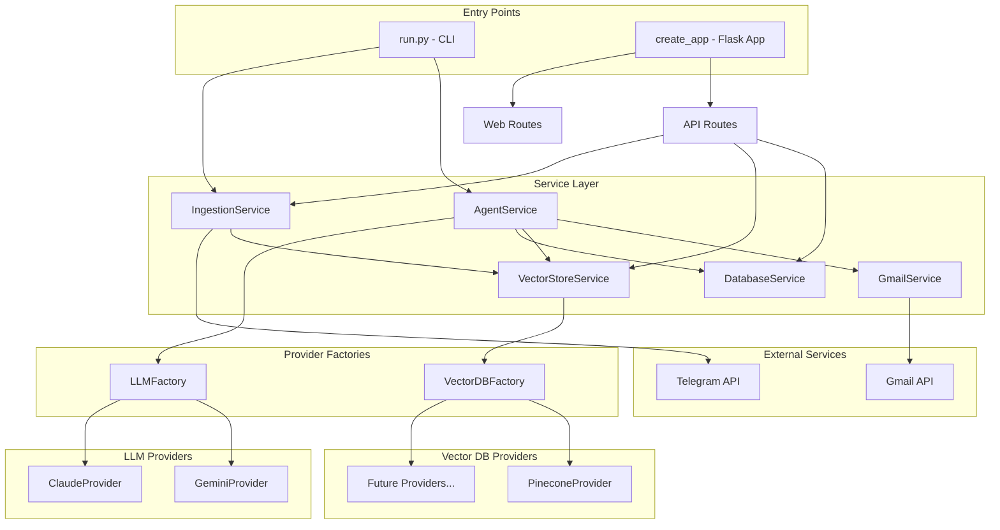
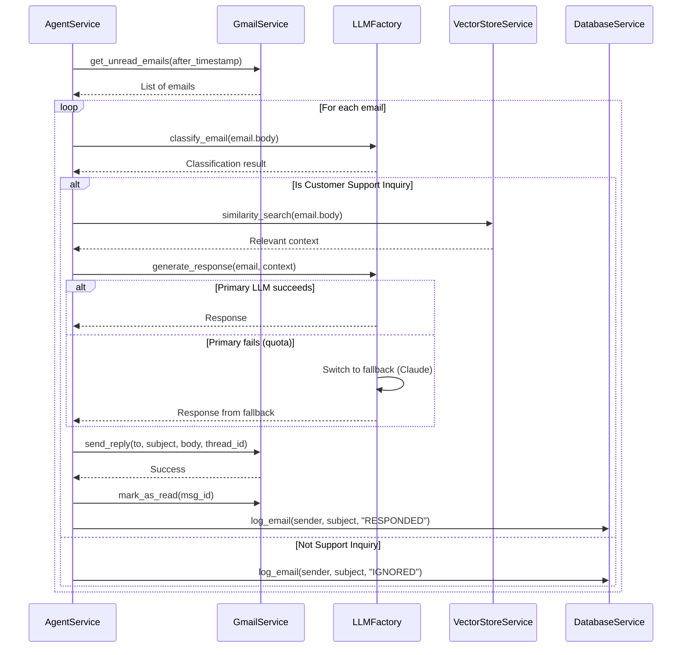
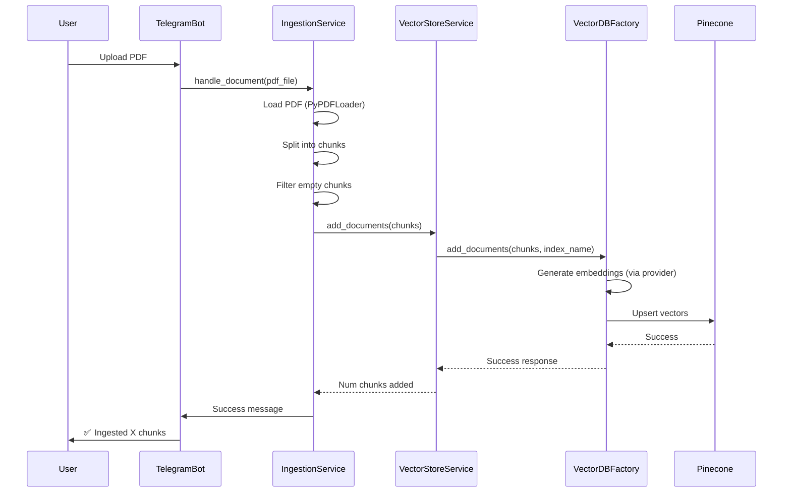

# System Architecture Overview

## Introduction

The AI Customer Support Agent is a sophisticated email automation system built on a modular, pluggable architecture. The system monitors Gmail inboxes, classifies incoming emails, and generates context-aware responses using Retrieval-Augmented Generation (RAG) with support for multiple LLM and Vector Database providers.

## Architecture Principles

### 1. **Pluggable Providers**
The system implements the **Factory Pattern** for both LLM and Vector Database providers, allowing seamless switching between different providers without code changes.

### 2. ** Single Responsibility**
Each service has a clearly defined responsibility following SOLID principles, making the system maintainable and testable.

### 3. **Separation of Concerns**
- **Services Layer**: Business logic and provider management
- **API Layer**: REST endpoints for dashboard
- **Web Layer**: Frontend rendering
- **CLI Layer**: Command-line interface for agent and ingestion

## System Components



## Core Services

### AgentService
**Purpose**: Orchestrates the email processing workflow

**Responsibilities**:
- Fetch unread emails from Gmail
- Classify emails using LLM (Customer Support Inquiry vs Other)
- Retrieve relevant context from Vector DB (RAG)
- Generate responses using LLM with fallback support
- Send threaded email replies
- Log all activities to database

**Key Dependencies**: `GmailService`, `VectorStoreService`, `LLMFactory`, `DatabaseService`

**File**: [`app/services/agent_service.py`](file:///Users/nayaneshgupte/AI%20Projects/RAG%20Demo/app/services/agent_service.py)

---

### GmailService (Facade)
**Purpose**: Unified interface to Gmail operations

**Responsibilities**:
- Delegates to specialized sub-services:
  - `GmailAuthService` - OAuth authentication
  - `GmailEmailReader` - Fetch and parse emails
  - `GmailEmailComposer` - Compose reply messages
  - `GmailEmailSender` - Send emails via API
  - `GmailEmailModifier` - Mark as read, modify labels
  - `GmailUserService` - Get user profile info

**Pattern**: Facade Pattern (maintains backward compatibility while using SRP-compliant internal services)

**File**: [`app/services/gmail_service.py`](file:///Users/nayaneshgupte/AI%20Projects/RAG%20Demo/app/services/gmail_service.py)

---

### VectorStoreService
**Purpose**: Unified interface to vector database operations

**Responsibilities**:
- Initialize provider via `VectorDBFactory`
- Add documents with embeddings
- Perform similarity search
- Get index statistics
- List and paginate documents

**Multi-Provider Support**: YES (via VectorDBFactory)

**File**: [`app/services/vector_store_service.py`](file:///Users/nayaneshgupte/AI%20Projects/RAG%20Demo/app/services/vector_store_service.py)

---

### IngestionService
**Purpose**: Process PDF documents and ingest into vector database

**Responsibilities**:
- Handle Telegram bot for PDF uploads
- Extract text from PDFs using PyPDFLoader
- Split documents into chunks (RecursiveCharacterTextSplitter)
- Filter empty chunks
- Generate embeddings and store in vector DB

**Integration**: Telegram Bot → PDF Processing → Vector DB

**File**: [`app/services/ingestion_service.py`](file:///Users/nayaneshgupte/AI%20Projects/RAG%20Demo/app/services/ingestion_service.py)

---

### DatabaseService
**Purpose**: SQLite database for activity logging

**Responsibilities**:
- Store email processing logs (timestamp, sender, subject, status, category)
- Provide statistics (total, responded, ignored)
- Support multi-user filtering (agent_email)

**Storage**: `email_logs.db` (SQLite)

**File**: [`app/services/database_service.py`](file:///Users/nayaneshgupte/AI%20Projects/RAG%20Demo/app/services/database_service.py)

---

## Provider Factories

### LLMFactory
**Purpose**: Manage multiple LLM providers with automatic fallback

**Supported Providers**:
- **Primary**: Google Gemini (`gemini-pro`)
- **Fallback**: Anthropic Claude (`claude-3-sonnet`)

**Features**:
- Automatic quota error detection (HTTP 429)
- Exponential backoff retry logic
- Seamless provider switching on failure
- Provider status monitoring

**Registry Pattern**: New providers can be registered dynamically

**File**: [`app/services/llm_providers/factory.py`](file:///Users/nayaneshgupte/AI%20Projects/RAG%20Demo/app/services/llm_providers/factory.py)

**See**: [Multi-LLM Architecture](llm/README.md)

---

### VectorDBFactory
**Purpose**: Manage multiple Vector DB providers

**Supported Providers**:
- **Primary**: Pinecone (Serverless)
- **Future**: Extensible for Weaviate, ChromaDB, etc.

**Features**:
- Provider abstraction via base interface
- Fallback support (configurable)
- Index management (get or create)
- Document operations (add, search, list, delete)

**Registry Pattern**: New providers register via `register_provider()`

**File**: [`app/services/vector_db_providers/factory.py`](file:///Users/nayaneshgupte/AI%20Projects/RAG%20Demo/app/services/vector_db_providers/factory.py)

**See**: [Multi-Vector DB Architecture](vector_db/README.md)

---

## Application Structure

```
app/
├── __init__.py                    # Flask app factory
├── config/
│   └── __init__.py               # Configuration management
├── api/
│   ├── __init__.py               # API Blueprint
│   └── routes.py                 # REST endpoints (/logs, /upload, /knowledge-base)
├── web/
│   ├── __init__.py               # Web Blueprint
│   └── routes.py                 # Web pages (/, /knowledge-base)
├── services/
│   ├── agent_service.py          # Email processing orchestration
│   ├── gmail_service.py          # Gmail facade
│   ├── gmail/                    # Gmail sub-services (SRP)
│   │   ├── auth_service.py
│   │   ├── email_reader.py
│   │   ├── email_composer.py
│   │   ├── email_sender.py
│   │   ├── email_modifier.py
│   │   └── user_service.py
│   ├── llm_providers/            # LLM abstraction
│   │   ├── base.py              # LLMProvider interface
│   │   ├── factory.py           # LLMFactory with fallback
│   │   ├── gemini_provider.py
│   │   └── claude_provider.py
│   ├── vector_db_providers/      # Vector DB abstraction
│   │   ├── base.py              # VectorDBProvider interface
│   │   ├── factory.py           # VectorDBFactory
│   │   ├── pinecone_provider.py
│   │   ├── pinecone_index_manager.py
│   │   └── pinecone_document_manager.py
│   ├── vector_store_service.py   # Vector DB facade
│   ├── ingestion_service.py      # PDF ingestion
│   └── database_service.py       # SQLite logging
├── utils/
│   ├── logger.py                 # Logging setup
│   └── prompt_loader.py          # Load prompts from files
├── templates/                     # Jinja2 templates
│   ├── dashboard.html
│   └── knowledge_base.html
└── static/                        # Static assets
    ├── css/
    └── js/
```

## Data Flow

### Email Processing Flow


### Document Ingestion Flow


## Key Design Decisions

### 1. **Factory Pattern for Providers**
**Why**: Allows adding new LLM or Vector DB providers without modifying existing code. Supports runtime provider selection and fallback.

### 2. **Facade Pattern for Gmail Service**
**Why**: Maintains backward compatibility while achieving Single Responsibility Principle internally. Each sub-service (auth, reader, sender, etc.) has one clear purpose.

### 3. **Service Layer Separation**
**Why**: Separates business logic from presentation. Services can be tested independently and reused across different interfaces (CLI, API, Web).

### 4. **Provider Abstraction via Base Classes**
**Why**: `LLMProvider` and `VectorDBProvider` base classes define contracts. New providers just need to implement the interface.

### 5. **Centralized Configuration**
**Why**: All environment variables and settings in `Config` class. Single source of truth, easy to modify.

## Configuration

All configuration is environment-based via `.env` file:

```env
# LLM Providers
GOOGLE_API_KEY=...                    # Primary LLM
ANTHROPIC_API_KEY=...                 # Fallback LLM
LLM_PRIMARY_PROVIDER=gemini          # Primary provider
LLM_FALLBACK_PROVIDERS=claude        # Comma-separated fallbacks

# Vector DB Providers
VECTOR_DB_TYPE=pinecone              # Primary vector DB
PINECONE_API_KEY=...
PINECONE_INDEX_NAME=...
PINECONE_ENV=...

# Gmail
GMAIL_CREDENTIALS_FILE=credentials.json
GMAIL_TOKEN_FILE=token.json

# Telegram
TELEGRAM_BOT_TOKEN=...

# RAG Settings
CHUNK_SIZE=1000
CHUNK_OVERLAP=150
```

## Further Reading

- [High-Level Design (HLD)](HIGH_LEVEL_DESIGN.md) - Detailed architecture diagrams
- [Sequence Diagrams](SEQUENCE_DIAGRAMS.md) - Detailed interaction flows
- [Multi-LLM Architecture](llm/README.md) - LLM provider system
- [Multi-Vector DB Architecture](vector_db/README.md) - Vector database provider system
- [Service Documentation](services/) - Individual service details
- [API Documentation](api/API_ROUTES.md) - REST API reference