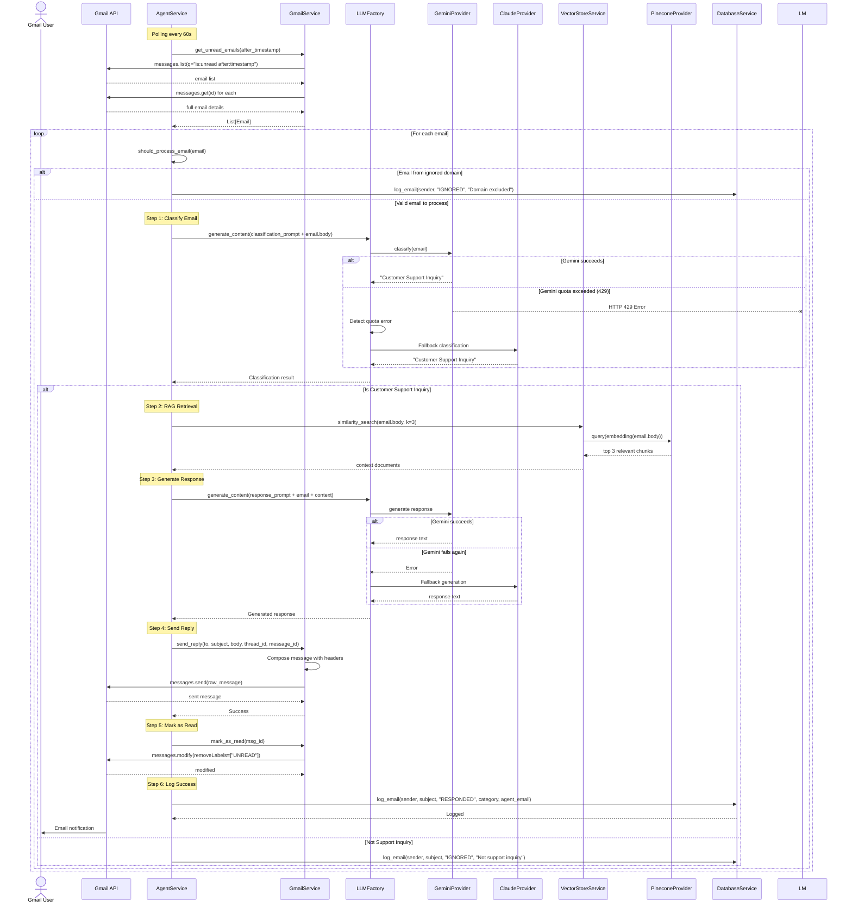
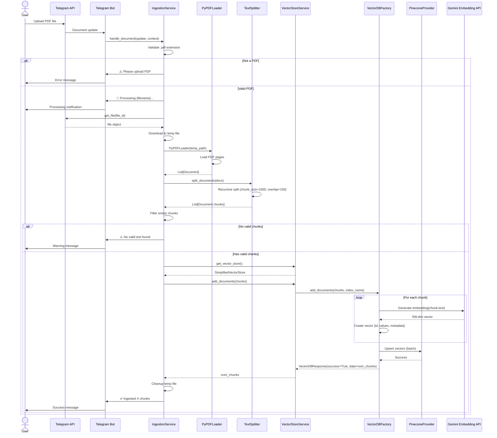
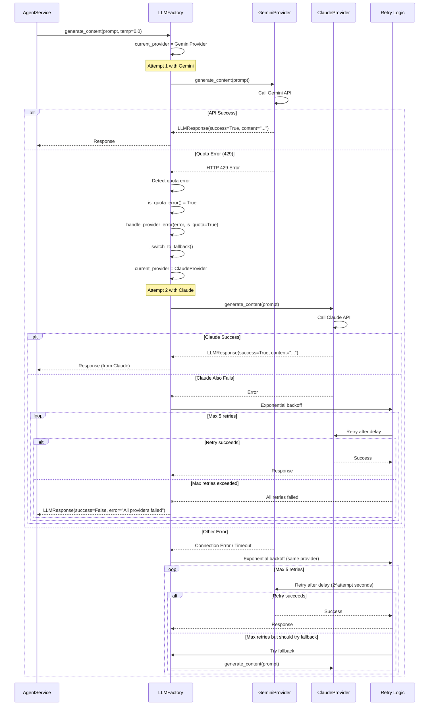
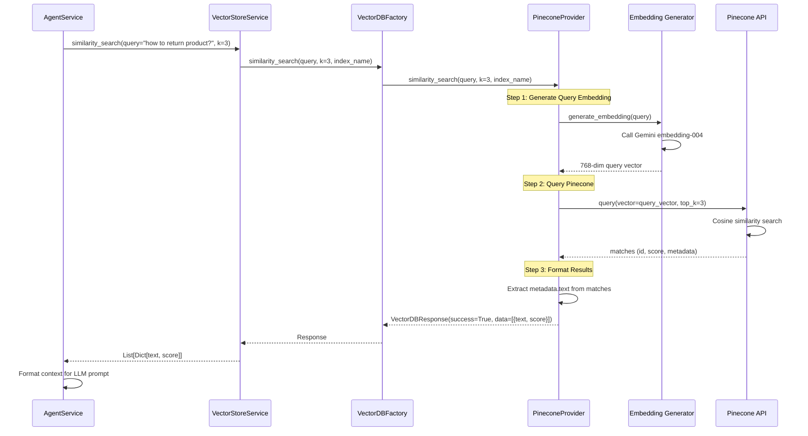
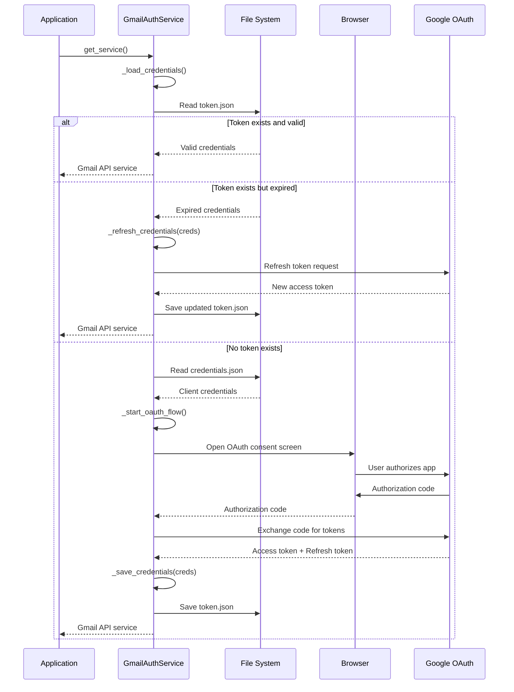
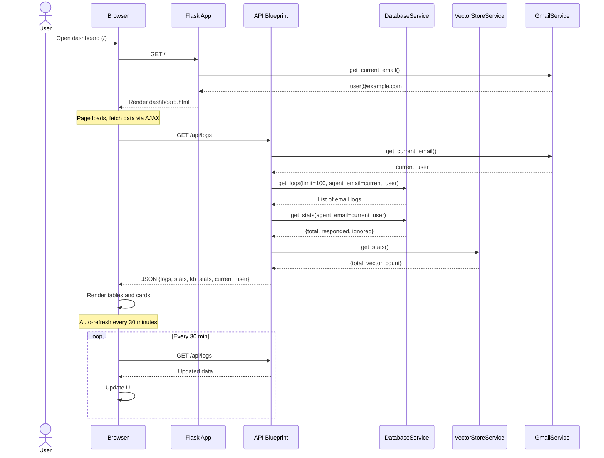
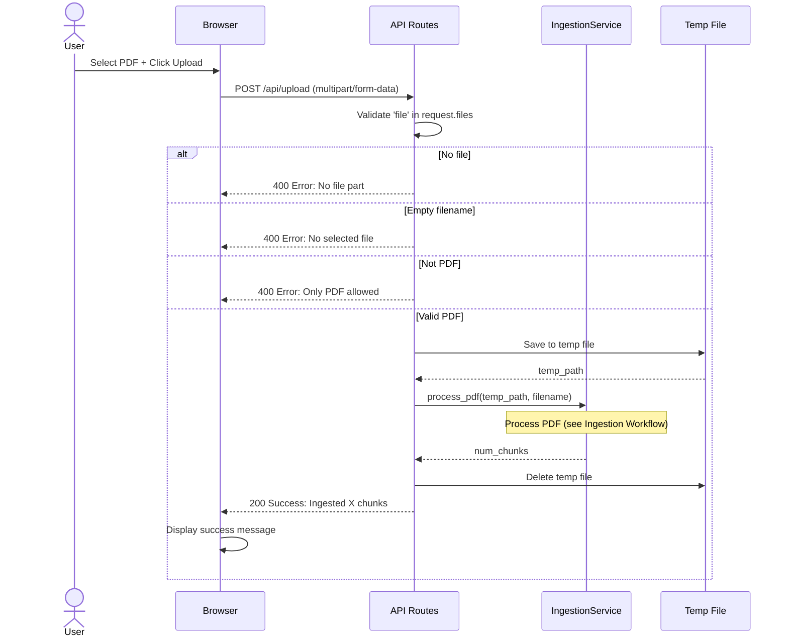
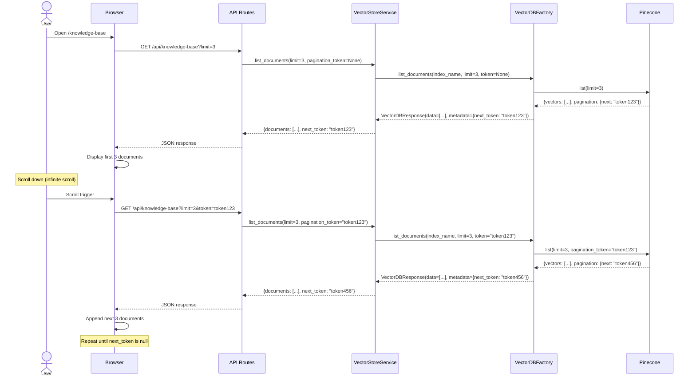
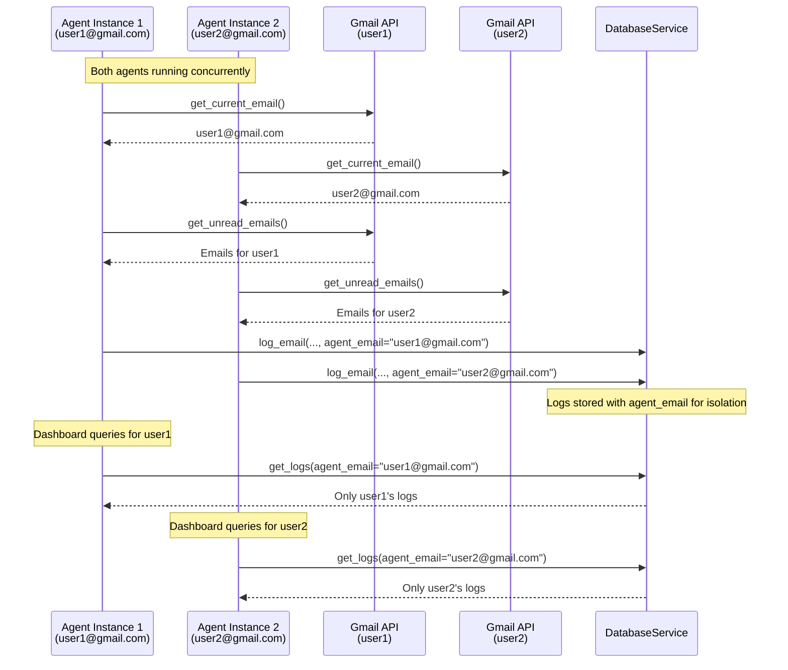

# Sequence Diagrams

This document provides detailed sequence diagrams for all major system workflows.

## 1. Email Processing Workflow (Complete Flow)



## 2. PDF Ingestion Workflow (Telegram Bot)



## 3. LLM Provider Fallback Flow



## 4. Vector DB Search Flow



## 5. Gmail Authentication Flow



## 6. Dashboard Data Flow



## 7. PDF Upload via Dashboard



## 8. Knowledge Base Pagination Flow



## 9. Multi-User Email Isolation



## Sequence Flow Summary

| Workflow | Primary Components | Key Interactions |
|----------|-------------------|------------------|
| **Email Processing** | Agent, Gmail, LLM, Vector DB, Database | Classify → RAG → Generate → Send → Log |
| **PDF Ingestion** | Telegram, Ingestion, Vector DB | Upload → Parse → Split → Embed → Store |
| **LLM Fallback** | LLM Factory, Gemini, Claude | Primary → Detect Error → Switch → Retry |
| **Vector Search** | Vector Store, Pinecone, Embedder | Query → Embed → Search → Format |
| **Gmail Auth** | Auth Service, Google OAuth, File System | Load → Validate → Refresh/Authorize → Save |
| **Dashboard** | Browser, Flask, API, Database | Render → Fetch → Display → Auto-refresh |
| **PDF Upload** | Browser, API, Ingestion | Upload → Validate → Process → Respond |
| **KB Pagination** | Browser, API, Vector DB, Pinecone | Initial → Scroll → Load More → Append |

## Error Handling Patterns

### Pattern 1: Provider Fallback (LLM)
- Detect error type (quota vs. other)
- Switch to fallback provider if quota
- Retry with exponential backoff if transient
- Return error only if all options exhausted

### Pattern 2: Graceful Degradation
- If email processing fails, log error and continue
- If PDF ingestion fails, inform user but don't crash
- If vector search fails, generate response without context

### Pattern 3: Retry with Exponential Backoff
```
Delay = min(baseDelay * (2 ^ attemptNumber), maxDelay)
```
- Prevents overwhelming failed services
- Gives temporary issues time to resolve

## Further Reading

- [Architecture Overview](README.md)
- [High-Level Design](HIGH_LEVEL_DESIGN.md)
- [Multi-LLM Architecture](llm/README.md)
- [Multi-Vector DB Architecture](vector_db/README.md)
