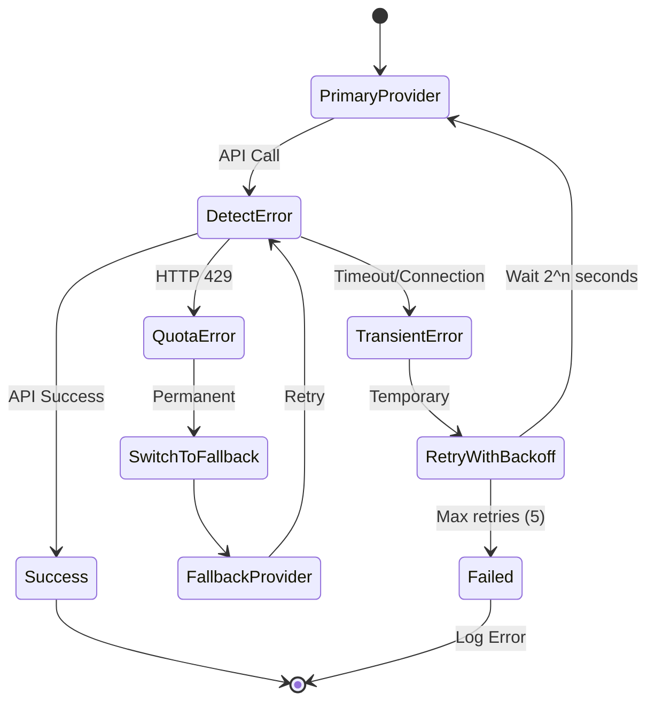

# Multi-LLM Provider Architecture

## Overview

The system supports multiple LLM providers through a **Factory Pattern** with **automatic fallback** capability. This design allows seamless switching between providers based on availability, quota limits, or performance requirements.

## Architecture

### Component Diagram

```mermaid
graph TB
    subgraph "Client Code"
        Agent[AgentService]
    end
    
    subgraph "LLM Factory"
        Factory[LLMFactory]
        Registry[Provider Registry<br/>Dict[str, Class]]
        Manager[Fallback Manager]
        Retry[Retry Logic]
    end
    
    subgraph "Provider Interface"
        Base[LLMProvider<br/>Abstract Base Class]
    end
    
    subgraph "Concrete Providers"
        Gemini[GeminiProvider<br/>gemini-pro]
        Claude[ClaudeProvider<br/>claude-3-sonnet]
        Future[OpenAIProvider<br/>GPT-4<br/>(Future)]
    end
    
    Agent -->|Uses| Factory
    Factory --> Registry
    Factory --> Manager
    Factory --> Retry
    Factory -->|Delegates to| Base
    
    Base <|.. Gemini
    Base <|.. Claude
    Base <|.. Future
    
    Registry -.->|Stores| Gemini
    Registry -.->|Stores| Claude
```

## LLMProvider Interface

All providers must implement the `LLMProvider` abstract base class:

```python
from abc import ABC, abstractmethod
from typing import Optional
from dataclasses import dataclass

@dataclass
class LLMResponse:
    success: bool
    content: str
    provider_name: str
    error: Optional[str] = None
    metadata: dict = None

class LLMProvider(ABC):
    @abstractmethod
    def generate_content(
        self,
        prompt: str,
        temperature: float = 0.0,
        max_tokens: int = 1024
    ) -> LLMResponse:
        """Generate content based on prompt"""
        pass
    
    @abstractmethod
    def get_provider_name(self) -> str:
        """Return provider identifier"""
        pass
    
    @abstractmethod
    def is_available(self) -> bool:
        """Check if provider is properly configured"""
        pass
```

## Supported Providers

### 1. Gemini Provider (Primary)

**Model**: `gemini-pro`  
**API**: Google Generative AI  
**Configuration**: `GOOGLE_API_KEY`

**Features**:
- Fast response times (1-3s)
- Good at classification tasks
- Excellent context understanding
- Free tier available

**Limitations**:
- Rate limits: 60 requests/minute (free tier)
- Quota can be exhausted quickly

**Implementation**: [`app/services/llm_providers/gemini_provider.py`](file:///Users/nayaneshgupte/AI%20Projects/RAG%20Demo/app/services/llm_providers/gemini_provider.py)

### 2. Claude Provider (Fallback)

**Model**: `claude-3-sonnet-20240229`  
**API**: Anthropic  
**Configuration**: `ANTHROPIC_API_KEY`

**Features**:
- High-quality responses
- Good reasoning capabilities
- Reliable fallback option
- Higher rate limits

**Limitations**:
- Slightly slower than Gemini
- Requires paid API key

**Implementation**: [`app/services/llm_providers/claude_provider.py`](file:///Users/nayaneshgupte/AI%20Projects/RAG%20Demo/app/services/llm_providers/claude_provider.py)

### 3. Future Providers

The architecture supports adding:
- **OpenAI** (GPT-4, GPT-3.5-turbo)
- **Cohere** (Command models)
- **Llama** (Self-hosted via Ollama)
- **PaLM** (Google Cloud)

## LLMFactory Features

### 1. Provider Registry

```python
class LLMFactory:
    PROVIDER_REGISTRY = {
        "gemini": GeminiProvider,
        "claude": ClaudeProvider,
    }
    
    @classmethod
    def register_provider(cls, name: str, provider_class):
        """Register new provider dynamically"""
        if not issubclass(provider_class, LLMProvider):
            raise ValueError("Must inherit from LLMProvider")
        cls.PROVIDER_REGISTRY[name] = provider_class
```

**Usage**:
```python
# Register custom provider
factory.register_provider("openai", OpenAIProvider)
```

### 2. Automatic Fallback



**Fallback Logic**:
1. Try primary provider (Gemini)
2. If quota error (HTTP 429):
   - Switch to fallback provider (Claude)
   - Don't retry primary until next request
3. If transient error (timeout, connection):
   - Retry with exponential backoff
   - Max 5 retries
4. If all providers fail:
   - Return error response
   - Log for monitoring

### 3. Quota Error Detection

```python
def _is_quota_error(self, error: Exception) -> bool:
    """Detect quota/rate limit errors"""
    error_str = str(error).lower()
    quota_indicators = [
        "429",
        "quota",
        "rate limit",
        "resource exhausted"
    ]
    return any(indicator in error_str for indicator in quota_indicators)
```

### 4. Exponential Backoff

```python
def generate_content(self, prompt, max_retries=5, retry_delay=5):
    for attempt in range(max_retries):
        try:
            return self.current_provider.generate_content(prompt)
        except Exception as e:
            if self._is_quota_error(e):
                self._switch_to_fallback()
            elif attempt < max_retries - 1:
                wait_time = min(retry_delay * (2 ** attempt), 60)
                time.sleep(wait_time)
            else:
                raise
```

## Configuration

### Environment Variables

```env
# Primary LLM Provider
LLM_PRIMARY_PROVIDER=gemini
GOOGLE_API_KEY=your_gemini_key_here

# Fallback LLM Providers (comma-separated)
LLM_FALLBACK_PROVIDERS=claude
ANTHROPIC_API_KEY=your_claude_key_here
```

### Programmatic Configuration

```python
from app.services.llm_providers.factory import LLMFactory

# Use defaults from Config
factory = LLMFactory()

# Custom configuration
factory = LLMFactory(
    primary_provider="claude",
    fallback_providers=["gemini"]
)
```

## Usage Examples

### Basic Usage

```python
from app.services.llm_providers.factory import LLMFactory

factory = LLMFactory()

# Generate content
response = factory.generate_content(
    prompt="Classify this email: ...",
    temperature=0.0,
    max_tokens=512
)

if response.success:
    print(f"Result: {response.content}")
    print(f"Provider: {response.provider_name}")
else:
    print(f"Error: {response.error}")
```

### With Automatic Fallback

```python
# No code changes needed - fallback is automatic
response = factory.generate_content(prompt)

# Internally:
# 1. Tries Gemini
# 2. If quota exceeded, switches to Claude
# 3. Retries with exponential backoff if needed
```

### Checking Provider Status

```python
status = factory.get_provider_status()
print(status)
# Output:
# {
#     "primary": {
#         "name": "gemini",
#         "available": True
#     },
#     "fallbacks": [
#         {
#             "name": "claude",
#             "available": True
#         }
#     ],
#     "current": "claude"  # If switched after quota error
# }
```

## Adding a New Provider

Follow these steps to add a new LLM provider:

### Step 1: Create Provider Class

```python
# app/services/llm_providers/openai_provider.py

from app.services.llm_providers.base import LLMProvider, LLMResponse
import openai

class OpenAIProvider(LLMProvider):
    def __init__(self, api_key: str):
        self.api_key = api_key
        openai.api_key = api_key
    
    def generate_content(self, prompt: str, temperature: float = 0.0, 
                        max_tokens: int = 1024) -> LLMResponse:
        try:
            response = openai.ChatCompletion.create(
                model="gpt-4",
                messages=[{"role": "user", "content": prompt}],
                temperature=temperature,
                max_tokens=max_tokens
            )
            
            content = response.choices[0].message.content
            
            return LLMResponse(
                success=True,
                content=content,
                provider_name=self.get_provider_name(),
                metadata={"model": "gpt-4"}
            )
        except Exception as e:
            return LLMResponse(
                success=False,
                content="",
                provider_name=self.get_provider_name(),
                error=str(e)
            )
    
    def get_provider_name(self) -> str:
        return "openai"
    
    def is_available(self) -> bool:
        return bool(self.api_key)
```

### Step 2: Register Provider

```python
# app/services/llm_providers/factory.py

from app.services.llm_providers.openai_provider import OpenAIProvider

class LLMFactory:
    PROVIDER_REGISTRY = {
        "gemini": GeminiProvider,
        "claude": ClaudeProvider,
        "openai": OpenAIProvider,  # Add here
    }
```

### Step 3: Add Configuration

```env
# .env
OPENAI_API_KEY=your_openai_key
LLM_FALLBACK_PROVIDERS=claude,openai
```

```python
# app/config/__init__.py

class Config:
    # ...
    OPENAI_API_KEY = os.getenv("OPENAI_API_KEY")
```

### Step 4: Update Factory Initialization

```python
# app/services/llm_providers/factory.py

def _create_provider(self, provider_name: str):
    if provider_name == "gemini":
        return GeminiProvider(Config.GOOGLE_API_KEY)
    elif provider_name == "claude":
        return ClaudeProvider(Config.ANTHROPIC_API_KEY)
    elif provider_name == "openai":  # Add this
        return OpenAIProvider(Config.OPENAI_API_KEY)
```

### Step 5: Use New Provider

```python
# Set as primary
factory = LLMFactory(primary_provider="openai")

# Or as fallback
factory = LLMFactory(
    primary_provider="gemini",
    fallback_providers=["openai", "claude"]
)
```

## Performance Characteristics

| Provider | Avg Response Time | Rate Limit (Free) | Cost |
|----------|-------------------|-------------------|------|
| **Gemini** | 1-3s | 60 req/min | Free |
| **Claude** | 2-4s | Higher | Paid |
| **Future: OpenAI** | 2-5s | Varies | Paid |

## Best Practices

### 1. **Configure Fallbacks**
Always configure at least one fallback provider to ensure 24/7 availability.

### 2. **Monitor Provider Usage**
Track which provider is being used via logs:
```python
logger.info(f"Using {response.provider_name} for generation")
```

### 3. **Set Appropriate Retries**
For critical operations, increase `max_retries`:
```python
response = factory.generate_content(prompt, max_retries=10)
```

### 4. **Handle Errors Gracefully**
Always check `response.success`:
```python
if not response.success:
    # Log error and notify admin
    logger.error(f"LLM generation failed: {response.error}")
```

### 5. **Provider-Specific Prompts** (Future)
Different providers may need different prompt formats. Factory can handle this:
```python
def _format_prompt_for_provider(self, prompt, provider_name):
    if provider_name == "claude":
        return f"\n\nHuman: {prompt}\n\nAssistant:"
    return prompt
```

## Monitoring & Debugging

### Log Messages

```
INFO: LLMFactory initialized with primary provider: gemini
INFO: Using gemini for content generation
WARNING: gemini quota exceeded, switching to claude
ERROR: All LLM providers failed: [gemini: quota exceeded, claude: timeout]
```

### Provider Status Endpoint (Future)

```python
@api_bp.route('/llm/status')
def llm_status():
    factory = LLMFactory()
    return jsonify(factory.get_provider_status())
```

## Security Considerations

- **API Keys**: Store in `.env`, never commit to git
- **Rate Limiting**: Factory handles quota errors to prevent API abuse
- **Input Validation**: Sanitize prompts before sending to providers
- **Output Filtering**: Validate generated content before using

## Further Reading

- [Architecture Overview](../README.md)
- [Sequence Diagrams - LLM Fallback Flow](../SEQUENCE_DIAGRAMS.md#3-llm-provider-fallback-flow)
- [Provider Implementation Guide](PROVIDER_IMPLEMENTATION.md)
- [AgentService Documentation](../services/AGENT_SERVICE.md)
