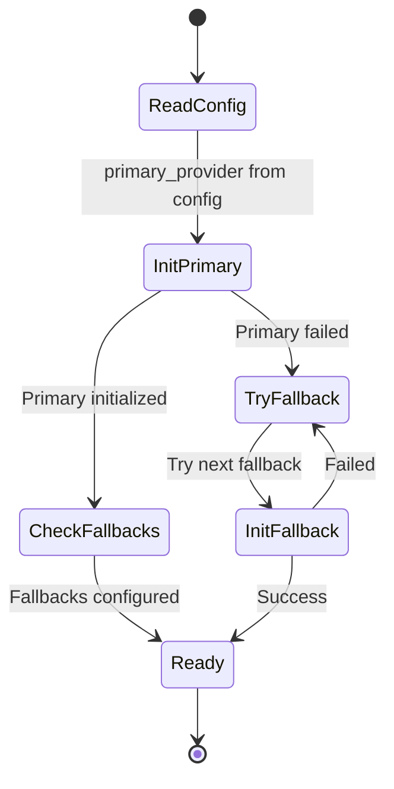
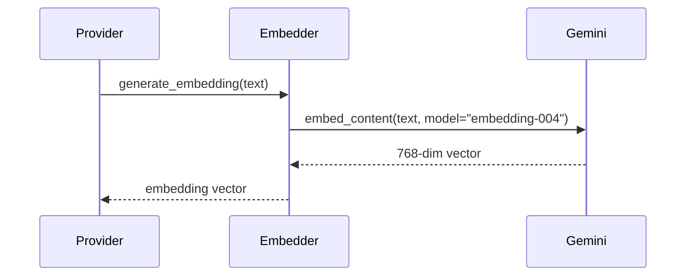

# Multi-Vector DB Provider Architecture

## Overview

The system supports multiple vector database providers through a **Factory Pattern** with provider abstraction. The architecture enables switching between vector databases (Pinecone, Weaviate, ChromaDB, etc.) without changing application code.

## Architecture

### Component Diagram

```mermaid
graph TB
    subgraph "Client Code"
        Agent[AgentService]
        Ingestion[IngestionService]
        API[API Routes]
    end
    
    subgraph "Vector Store Service"
        VSS[VectorStoreService<br/>Facade]
    end
    
    subgraph "Vector DB Factory"
        Factory[VectorDBFactory]
        Registry[Provider Registry]
    end
    
    subgraph "Provider Interface"
        Base[VectorDBProvider<br/>Abstract Base]
    end
    
    subgraph "Concrete Providers"
        Pinecone[PineconeProvider]
        PIdx[IndexManager]
        PDoc[DocumentManager]
        
        Future1[WeaviateProvider<br/>(Future)]
        Future2[ChromaProvider<br/>(Future)]
    end
    
    Agent --> VSS
    Ingestion --> VSS
    API --> VSS
    
    VSS --> Factory
    Factory --> Registry
    Factory -->|Delegates to| Base
    
    Base <|.. Pinecone
    Base <|.. Future1
    Base <|.. Future2
    
    Pinecone --> PIdx
    Pinecone --> PDoc
    
    Registry -.->|Stores| Pinecone
```

## VectorDBProvider Interface

All providers must implement the `VectorDBProvider` abstract base class:

```python
from abc import ABC, abstractmethod
from dataclasses import dataclass
from typing import List, Dict, Optional, Any

@dataclass
class VectorDBResponse:
    success: bool
    data: Any
    error: Optional[str] = None
    metadata: Dict = None
    provider_name: str = ""

class VectorDBProvider(ABC):
    @abstractmethod
    def get_or_create_index(self, index_name: str, 
                           dimension: Optional[int] = None) -> bool:
        """Get existing index or create if doesn't exist"""
        pass
    
    @abstractmethod
    def add_documents(self, documents: List[Dict], 
                     index_name: str) -> VectorDBResponse:
        """Add documents with embeddings to index"""
        pass
    
    @abstractmethod
    def similarity_search(self, query: str, k: int, 
                         index_name: str) -> VectorDBResponse:
        """Search for similar documents"""
        pass
    
    @abstractmethod
    def get_index_stats(self, index_name: str) -> VectorDBResponse:
        """Get index statistics (total vectors, dimension, etc.)"""
        pass
    
    @abstractmethod
    def list_documents(self, index_name: str, limit: int,
                      pagination_token: Optional[str]) -> VectorDBResponse:
        """List documents with pagination"""
        pass
    
    @abstractmethod
    def delete_document(self, document_id: str, 
                       index_name: str) -> VectorDBResponse:
        """Delete document by ID"""
        pass
    
    @abstractmethod
    def get_provider_name(self) -> str:
        """Return provider identifier"""
        pass
```

## Supported Providers

### 1. Pinecone Provider (Primary)

**Type**: Serverless Vector Database  
**API**: Pinecone  
**Configuration**: `PINECONE_API_KEY`, `PINECONE_INDEX_NAME`

**Features**:
- Serverless architecture (auto-scaling)
- High performance for queries
- Native support for metadata filtering
- Embedding generation via Gemini

**Architecture**:
```
PineconeProvider
├── IndexManager      # Index lifecycle (create, describe, stats)
├── DocumentManager   # Document operations (add, list, delete)
└── EmbeddingGenerator  # Generate embeddings via Gemini
```

**Implementation**: [`app/services/vector_db_providers/pinecone_provider.py`](file:///Users/nayaneshgupte/AI%20Projects/RAG%20Demo/app/services/vector_db_providers/pinecone_provider.py)

**Sub-Components**:
- [`pinecone_index_manager.py`](file:///Users/nayaneshgupte/AI%20Projects/RAG%20Demo/app/services/vector_db_providers/pinecone_index_manager.py) - Index management
- [`pinecone_document_manager.py`](file:///Users/nayaneshgupte/AI%20Projects/RAG%20Demo/app/services/vector_db_providers/pinecone_document_manager.py) - Document operations

### 2. Future Providers

The architecture supports adding:
- **Weaviate** (Open-source, self-hosted)
- **ChromaDB** (Lightweight, local-first)
- **Qdrant** (High-performance Rust-based)
- **Milvus** (Distributed vector DB)

## VectorDBFactory Features

### 1. Provider Registry

```python
class VectorDBFactory:
    _PROVIDER_REGISTRY = {}
    
    @classmethod
    def register_provider(cls, name: str, provider_class):
        """Register a vector database provider"""
        if not issubclass(provider_class, VectorDBProvider):
            raise ValueError("Must inherit from VectorDBProvider")
        cls._PROVIDER_REGISTRY[name] = provider_class
        logger.info(f"Registered Vector DB provider: {name}")
```

**Default Registration**:
```python
# At module load
VectorDBFactory.register_provider('pinecone', PineconeProvider)
```

### 2. Provider Selection



**Configuration**:
```env
VECTOR_DB_TYPE=pinecone                    # Primary provider
VECTOR_DB_FALLBACK_PROVIDERS=weaviate     # Comma-separated fallbacks
```

### 3. Embedding Generation

All providers use the same embedding service:

```python
# Gemini embedding-004 model
embed_model = "models/text-embedding-004"
dimension = 768
```

**Flow**:


## VectorStoreService (Facade)

Provides a simplified interface to Vector DB operations:

```python
class VectorStoreService:
    def __init__(self, vector_db_type=None, fallback_providers=None):
        self.factory = VectorDBFactory(
            primary_provider=vector_db_type or Config.VECTOR_DB_TYPE,
            fallback_providers=fallback_providers or Config.VECTOR_DB_FALLBACK_PROVIDERS
        )
    
    def add_documents(self, documents: List[Dict]) -> int:
        """Add documents, return count"""
        response = self.factory.add_documents(documents, index_name)
        return response.data if response.success else 0
    
    def similarity_search(self, query: str, k: int = 3) -> List[Dict]:
        """Search for similar documents"""
        response = self.factory.similarity_search(query, k, index_name)
        return response.data if response.success else []
    
    def get_stats(self) -> Dict:
        """Get index statistics"""
        response = self.factory.get_index_stats(index_name)
        return response.data if response.success else {}
    
    def list_documents(self, limit: int = 3, 
                      pagination_token: str = None) -> Dict:
        """List documents with pagination"""
        response = self.factory.list_documents(index_name, limit, pagination_token)
        return {
            'documents': response.data or [],
            'next_token': response.metadata.get('next_token') if response.metadata else None
        }
```

## Configuration

### Environment Variables

```env
# Primary Vector DB
VECTOR_DB_TYPE=pinecone
PINECONE_API_KEY=your_pinecone_key
PINECONE_INDEX_NAME=customer-support-kb
PINECONE_ENVIRONMENT=us-east-1

# Fallback Vector DBs (optional)
VECTOR_DB_FALLBACK_PROVIDERS=weaviate
WEAVIATE_URL=http://localhost:8080

# Embedding Configuration
EMBEDDING_MODEL=models/text-embedding-004
EMBEDDING_DIMENSION=768

# Document Processing
CHUNK_SIZE=1000
CHUNK_OVERLAP=150
```

### Programmatic Configuration

```python
from app.services.vector_store_service import VectorStoreService

# Use default configuration
vector_store = VectorStoreService()

# Custom provider
vector_store = VectorStoreService(
    vector_db_type="weaviate",
    fallback_providers=["pinecone"]
)
```

## Usage Examples

### Basic Operations

```python
from app.services.vector_store_service import VectorStoreService

vector_store = VectorStoreService()

# Add documents
documents = [
    {"text": "Product return policy...", "metadata": {"source": "manual.pdf"}},
    {"text": "Shipping information...", "metadata": {"source": "manual.pdf"}}
]
num_added = vector_store.add_documents(documents)
print(f"Added {num_added} documents")

# Search for similar documents
results = vector_store.similarity_search("How do I return a product?", k=3)
for result in results:
    print(f"Score: {result['score']}, Text: {result['text']}")

# Get statistics
stats = vector_store.get_stats()
print(f"Total vectors: {stats.get('total_vector_count', 0)}")

# List documents with pagination
page1 = vector_store.list_documents(limit=10)
for doc in page1['documents']:
    print(doc['id'], doc['metadata'])

# Next page
if page1['next_token']:
    page2 = vector_store.list_documents(limit=10, pagination_token=page1['next_token'])
```

### Provider Status

```python
status = vector_store.get_provider_status()
print(status)
# {
#     "primary": {
#         "name": "pinecone",
#         "available": True,
#         "index": "customer-support-kb"
#     },
#     "fallbacks": [],
#     "current_provider": "pinecone"
# }
```

## Adding a New Provider

### Example: Weaviate Provider

#### Step 1: Create Provider Class

```python
# app/services/vector_db_providers/weaviate_provider.py

from app.services.vector_db_providers.base import VectorDBProvider, VectorDBResponse
import weaviate

class WeaviateProvider(VectorDBProvider):
    def __init__(self, url: str):
        self.url = url
        self.client = weaviate.Client(url)
    
    def get_or_create_index(self, index_name: str, dimension: int = None) -> bool:
        # Check if class exists
        schema = self.client.schema.get()
        exists = any(c['class'] == index_name for c in schema.get('classes', []))
        
        if not exists:
            # Create class
            class_obj = {
                "class": index_name,
                "vectorizer": "none",  # We provide vectors
                "properties": [
                    {"name": "text", "dataType": ["text"]},
                    {"name": "metadata", "dataType": ["text"]}
                ]
            }
            self.client.schema.create_class(class_obj)
        
        return True
    
    def add_documents(self, documents: List[Dict], index_name: str) -> VectorDBResponse:
        try:
            # Generate embeddings
            for doc in documents:
                embedding = self._generate_embedding(doc['text'])
                
                # Add to Weaviate
                self.client.data_object.create(
                    data_object={
                        "text": doc['text'],
                        "metadata": json.dumps(doc.get('metadata', {}))
                    },
                    class_name=index_name,
                    vector=embedding
                )
            
            return VectorDBResponse(
                success=True,
                data=len(documents),
                provider_name="weaviate"
            )
        except Exception as e:
            return VectorDBResponse(
                success=False,
                data=None,
                error=str(e),
                provider_name="weaviate"
            )
    
    def similarity_search(self, query: str, k: int, index_name: str) -> VectorDBResponse:
        try:
            query_vector = self._generate_embedding(query)
            
            results = (
                self.client.query
                .get(index_name, ["text", "metadata"])
                .with_near_vector({"vector": query_vector})
                .with_limit(k)
                .do()
            )
            
            objects = results['data']['Get'][index_name]
            formatted = [
                {
                    "text": obj['text'],
                    "metadata": json.loads(obj['metadata']),
                    "score": 1.0  # Weaviate returns certainty
                }
                for obj in objects
            ]
            
            return VectorDBResponse(
                success=True,
                data=formatted,
                provider_name="weaviate"
            )
        except Exception as e:
            return VectorDBResponse(
                success=False,
                data=[],
                error=str(e),
                provider_name="weaviate"
            )
    
    def _generate_embedding(self, text: str) -> List[float]:
        # Use same embedding as other providers (Gemini)
        from app.services.llm_providers.gemini_provider import GeminiProvider
        gemini = GeminiProvider(Config.GOOGLE_API_KEY)
        return gemini.generate_embedding(text)
    
    def get_provider_name(self) -> str:
        return "weaviate"
    
    # Implement other required methods...
```

#### Step 2: Register Provider

```python
# app/services/vector_db_providers/factory.py

from app.services.vector_db_providers.weaviate_provider import WeaviateProvider

# At module load
VectorDBFactory.register_provider('weaviate', WeaviateProvider)
```

#### Step 3: Configure

```env
VECTOR_DB_TYPE=weaviate
WEAVIATE_URL=http://localhost:8080

# Or as fallback
VECTOR_DB_TYPE=pinecone
VECTOR_DB_FALLBACK_PROVIDERS=weaviate
```

#### Step 4: Update Factory Initialization

```python
def _create_provider(self, provider_name: str):
    if provider_name == "pinecone":
        return PineconeProvider(
            api_key=Config.PINECONE_API_KEY,
            index_name=Config.PINECONE_INDEX_NAME
        )
    elif provider_name == "weaviate":
        return WeaviateProvider(url=Config.WEAVIATE_URL)
```

## Data Model

### Document Structure

```python
document = {
    "text": "Full chunk text content",
    "metadata": {
        "source": "filename.pdf",
        "page": 5,
        "chunk_id": "doc123_chunk5"
    }
}
```

### Vector Format (Pinecone)

```python
vector = {
    "id": "doc123_chunk5",
    "values": [0.123, 0.456, ..., 0.789],  # 768-dimensional
    "metadata": {
        "text": "Full chunk text...",
        "source": "filename.pdf",
        "page": 5
    }
}
```

## Performance Characteristics

| Provider | Query Latency | Indexing Speed | Scalability |
|----------|---------------|----------------|-------------|
| **Pinecone** | 50-200ms | Fast (serverless) | Automatic |
| **Weaviate** | 10-100ms | Fast | Manual scaling |
| **ChromaDB** | 5-50ms | Very Fast | Local only |
| **Qdrant** | 20-80ms | Fast | Manual/Cloud |

## Best Practices

### 1. **Index Management**
Create indexes with appropriate dimensions before adding documents:
```python
vector_store.get_or_create_index(index_name="my-index", dimension=768)
```

### 2. **Batch Operations**
Add documents in batches for better performance:
```python
# Good: Batch upload
vector_store.add_documents(chunk_list)  # Adds all at once

# Bad: One-by-one
for chunk in chunk_list:
    vector_store.add_documents([chunk])  # Slow
```

### 3. **Metadata Filtering** (Future)
Leverage provider metadata filtering capabilities:
```python
# Future implementation
results = vector_store.similarity_search(
    query="...",
    k=5,
    filter={"source": "product_manual.pdf"}
)
```

### 4. **Error Handling**
Always check response success:
```python
response = factory.add_documents(documents, index_name)
if not response.success:
    logger.error(f"Failed to add documents: {response.error}")
```

### 5. **Pagination**
Use pagination for large result sets:
```python
token = None
while True:
    result = vector_store.list_documents(limit=100, pagination_token=token)
    process_documents(result['documents'])
    token = result['next_token']
    if not token:
        break
```

## Monitoring

### Log Messages

```
INFO: VectorDBFactory initialized with pinecone
INFO: Index customer-support-kb ready (768 dimensions)
INFO: Added 42 documents to index
WARNING: Pinecone indexing delay detected (eventual consistency)
ERROR: Vector DB operation failed: Connection timeout
```

### Metrics to Track (Future)

- Total vectors in index
- Query latency (p50, p95, p99)
- Index size
- Documents added per day
- Search accuracy

## Security Considerations

- **API Keys**: Store in `.env`, never commit
- **Access Control**: Use provider-level access controls
- **Data Privacy**: Metadata can contain sensitive info
- **Encryption**: Use provider's encryption at rest/in transit

## Further Reading

- [Architecture Overview](../README.md)
- [Sequence Diagrams - Vector Search Flow](../SEQUENCE_DIAGRAMS.md#4-vector-db-search-flow)
- [VectorStoreService Implementation](../../services/VECTOR_STORE_SERVICE.md)
- [Ingestion Service Documentation](../services/INGESTION_SERVICE.md)
