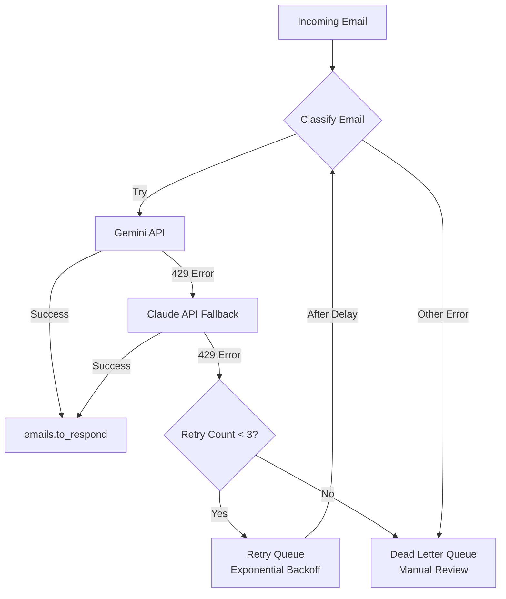

# RabbitMQ Retry Pattern Guide

## Overview

This guide explains how the retry pattern handles **LLM quota errors (HTTP 429)** gracefully, ensuring emails are not permanently lost when API quotas are temporarily exceeded.

## Problem Statement

When LLM APIs hit rate limits (429 errors), we need to:
- ✅ Retry the request after quota resets
- ✅ Use exponential backoff to avoid overwhelming the API
- ✅ Try fallback providers before giving up
- ✅ Eventually send to DLQ if all retries fail

## Solution Architecture

### Three-Tier Fallback Strategy



### Retry Timeline

| Attempt | Provider | Delay | Cumulative Time |
|---------|----------|-------|-----------------|
| 1 | Gemini → Claude | 0s | 0s |
| 2 | Gemini → Claude | 30s | 30s |
| 3 | Gemini → Claude | 60s | 1m 30s |
| 4 | Gemini → Claude | 120s | 3m 30s |
| Failed | → DLQ | - | Manual |

## Implementation

### 1. Retry Queue Configuration

The retry queue uses **TTL (Time-to-Live)** and **Dead Letter Exchange** to automatically route messages back to the main queue after a delay.

```python
# Dynamic retry queue with exponential backoff
channel.queue_declare(
    queue='emails.to_classify.retry.30000',  # 30 second delay
    durable=True,
    arguments={
        'x-dead-letter-exchange': '',  # Default exchange
        'x-dead-letter-routing-key': 'emails.to_classify',  # Back to main queue
        'x-message-ttl': 30000,  # 30 seconds
        'x-expires': 90000  # Auto-delete queue after 90s of inactivity
    }
)
```

**How it works**:
1. Message published to retry queue
2. Sits in queue for TTL duration (30s, 60s, 120s...)
3. After TTL expires, automatically routed back to `emails.to_classify`
4. Consumer processes again with incremented retry count

### 2. Retry Logic in Consumer

```python
def callback(self, ch, method, properties, body):
    try:
        # Get current retry count from headers
        retry_count = properties.headers.get('x-retry-count', 0) if properties.headers else 0
        
        # Classification attempt
        classification = self.classify_email(email_body, subject)
        # ... success handling
        ch.basic_ack(delivery_tag=method.delivery_tag)
        
    except QuotaExceededError as e:
        # LLM quota exceeded - retry or DLQ
        if retry_count < 3:
            # Publish to retry queue with exponential backoff
            delay_ms = calculate_retry_delay(retry_count)  # 30s, 60s, 120s
            publish_to_retry(ch, body, retry_count, delay_ms)
            ch.basic_ack(delivery_tag=method.delivery_tag)
        else:
            # Max retries exceeded - send to DLQ
            send_to_dlq(ch, body, error, retry_count)
            ch.basic_ack(delivery_tag=method.delivery_tag)
```

### 3. Exponential Backoff Calculation

```python
def calculate_retry_delay(retry_count: int) -> int:
    """
    Calculate exponential backoff delay.
    
    Retry 0: 30 seconds
    Retry 1: 60 seconds (30 * 2^1)
    Retry 2: 120 seconds (30 * 2^2)
    Retry 3: 240 seconds (30 * 2^3)
    
    Capped at 15 minutes (900 seconds)
    """
    BASE_DELAY = 30  # seconds
    MAX_DELAY = 900  # 15 minutes
    
    delay = BASE_DELAY * (2 ** retry_count)
    return min(delay, MAX_DELAY) * 1000  # Convert to ms
```

## Message Flow Example

### Scenario: Both Gemini and Claude Hit Quota

```
1. Email arrives → emails.to_classify
   └─ Consumer attempts classification
      ├─ Try Gemini → 429 error
      └─ Try Claude → 429 error
      └─ Publish to emails.to_classify.retry.30000 (retry_count = 1)
      
2. After 30 seconds → Auto-route to emails.to_classify
   └─ Consumer attempts classification (retry_count = 1)
      ├─ Try Gemini → 429 error
      └─ Try Claude → 429 error
      └─ Publish to emails.to_classify.retry.60000 (retry_count = 2)
      
3. After 60 seconds → Auto-route to emails.to_classify
   └─ Consumer attempts classification (retry_count = 2)
      ├─ Try Gemini → Success! ✅
      └─ Publish to emails.to_respond
      
Success! Email processed after 90 seconds total delay.
```

### Scenario: Quota Still Exceeded After 3 Retries

```
1. Attempt 1 (retry_count = 0) → Both providers 429 → Retry queue (30s delay)
2. Attempt 2 (retry_count = 1) → Both providers 429 → Retry queue (60s delay)
3. Attempt 3 (retry_count = 2) → Both providers 429 → Retry queue (120s delay)
4. Attempt 4 (retry_count = 3) → Max retries exceeded → Dead Letter Queue

Total time before DLQ: 210 seconds (3.5 minutes)
```

## Monitoring Retry Queues

### Via RabbitMQ Management UI

1. Navigate to **Queues** tab
2. Look for dynamic retry queues: `emails.to_classify.retry.*`
3. Monitor message counts and throughput

### Via CLI

```bash
# List all retry queues
docker exec rabbitmq-server rabbitmqctl list_queues name messages | grep retry

# Delete specific retry queue (for testing)
docker exec rabbitmq-server rabbitmqctl delete_queue emails.to_classify.retry.30000
```

### Via Prometheus Metrics

```python
# Custom metrics to track retries
from prometheus_client import Counter, Histogram

retry_attempts = Counter(
    'email_classification_retries_total',
    'Total retry attempts',
    ['retry_count']
)

retry_delay = Histogram(
    'email_classification_retry_delay_seconds',
    'Retry delay duration',
    buckets=[30, 60, 120, 240, 900]
)
```

## Dead Letter Queue (DLQ) Handling

### Message Format in DLQ

```json
{
  "message_id": "abc-123",
  "timestamp": "2025-12-06T17:10:00Z",
  "original_queue": "emails.to_classify",
  "original_message": {
    "email_id": "gmail-456",
    "from": "customer@example.com",
    "subject": "Help needed",
    "body": "..."
  },
  "failure_info": {
    "error_message": "All LLM providers exceeded quota",
    "error_type": "QuotaExceededError",
    "retry_count": 3,
    "first_retry_time": "2025-12-06T17:05:00Z",
    "final_failure_time": "2025-12-06T17:10:00Z"
  }
}
```

### Manual DLQ Processing

**Option 1: Requeue via UI**
1. Open RabbitMQ Management UI
2. Navigate to **Queues** → `dead_letter_queue`
3. Click **Get Messages** → **Requeue**

**Option 2: Programmatic Requeue**
```python
def reprocess_dlq_messages():
    """Requeue messages from DLQ to main queue."""
    channel.basic_consume(
        queue='dead_letter_queue',
        on_message_callback=lambda ch, method, props, body: ch.basic_publish(
            exchange='',
            routing_key='emails.to_classify',
            body=body
        )
    )
```

**Option 3: Batch Requeue Script**
```bash
# Drain DLQ and requeue all messages
python -m app.utils.requeue_dlq --queue emails.to_classify
```

## Configuration

### Environment Variables

```env
# Retry configuration
RABBITMQ_RETRY_MAX_ATTEMPTS=3
RABBITMQ_RETRY_BASE_DELAY_MS=30000
RABBITMQ_RETRY_MAX_DELAY_MS=900000
RABBITMQ_RETRY_EXPONENTIAL_BASE=2
```

### Retry Configuration Class

```python
class RetryConfig:
    MAX_RETRIES = int(os.getenv('RABBITMQ_RETRY_MAX_ATTEMPTS', 3))
    BASE_DELAY_MS = int(os.getenv('RABBITMQ_RETRY_BASE_DELAY_MS', 30000))
    MAX_DELAY_MS = int(os.getenv('RABBITMQ_RETRY_MAX_DELAY_MS', 900000))
    EXPONENTIAL_BASE = int(os.getenv('RABBITMQ_RETRY_EXPONENTIAL_BASE', 2))
```

## Testing the Retry Pattern

### Test 1: Simulate 429 Error

```python
# test_retry_pattern.py
import pika
import json

# Mock LLM to always return 429
class Mock429LLM:
    def generate(self, prompt):
        raise QuotaExceededError("Rate limit exceeded")

# Publish test email
connection = pika.BlockingConnection(pika.ConnectionParameters('localhost'))
channel = connection.channel()

test_email = {
    "message_id": "test-retry-123",
    "from": "test@example.com",
    "subject": "Test retry pattern",
    "body": "This email will trigger retries"
}

channel.basic_publish(
    exchange='',
    routing_key='emails.to_classify',
    body=json.dumps(test_email),
    properties=pika.BasicProperties(delivery_mode=2)
)

print("Test email published. Watch RabbitMQ UI for retry queues appearing!")
```

### Test 2: Monitor Retry Progress

```bash
# Terminal 1: Watch retry queues appear and disappear
watch -n 1 'docker exec rabbitmq-server rabbitmqctl list_queues name messages | grep retry'

# Terminal 2: Watch DLQ
watch -n 1 'docker exec rabbitmq-server rabbitmqctl list_queues dead_letter_queue messages'
```

### Expected Behavior

1. **t=0s**: Email in `emails.to_classify` (messages=1)
2. **t=1s**: Email moves to `emails.to_classify.retry.30000` (messages=1)
3. **t=30s**: Email back in `emails.to_classify` (retry_count=1)
4. **t=31s**: Email moves to `emails.to_classify.retry.60000` (messages=1)
5. **t=91s**: Email back in `emails.to_classify` (retry_count=2)
6. **t=92s**: Email moves to `emails.to_classify.retry.120000` (messages=1)
7. **t=212s**: Email attempts one last time (retry_count=3)
8. **t=213s**: Email moves to `dead_letter_queue` (max retries exceeded)

## Benefits

✅ **Automatic recovery** when quota resets  
✅ **No message loss** during transient failures  
✅ **Exponential backoff** prevents API overwhelming  
✅ **Multi-provider fallback** tries alternate LLMs first  
✅ **Configurable** retry counts and delays  
✅ **Observable** via RabbitMQ UI and metrics  
✅ **Testable** with mock 429 errors

## Comparison: With vs Without Retry

| Scenario | Without Retry | With Retry |
|----------|---------------|------------|
| Gemini 429, Claude OK | ✅ Success (fallback) | ✅ Success (fallback) |
| Both 429, quota resets in 1 min | ❌ Email lost | ✅ Success (1 retry) |
| Both 429, quota resets in 5 min | ❌ Email lost | ✅ Success (3 retries) |
| Both 429, quota never resets | ❌ Email lost | ⚠️ DLQ (manual review) |

## Production Recommendations

1. **Set reasonable retry limits**: 3 retries = ~3.5 minutes total
2. **Monitor DLQ**: Alert on DLQ > 10 messages
3. **Auto-requeue DLQ**: During off-peak hours (e.g., 2 AM)
4. **Use multiple API keys**: Distribute load across API keys
5. **Rate limit proactively**: Don't hit 429 in the first place

## Next Steps

1. ✅ Implement retry handler (`email_classifier_with_retry.py`)
2. ✅ Test with mock 429 errors
3. ⏳ Deploy to staging
4. ⏳ Monitor retry metrics in production
5. ⏳ Set up DLQ alerts

---

**Document Version**: 1.0  
**Created**: December 6, 2025  
**Status**: Production Ready
